# Gottfrids munkar

Detta är en hittepå-webshop som säljer munkar. Den har byggts som skolarbete
enligt diverse krav på funktioner.

På sidan kan användaren välja produkter som sedan läggs till i varukorgen. Från
varukorgen kan användaren gå till en checkout där det finns en
ordersammanställning och ett formulär med beställnings- och användardata.

Sidan är byggd i vanilla Javascript med några enklare hjälpverktyg. Det har
lagts extra tanke på tillgänglighetsaspekten.

Sidan byggd av Janis Seibutis: (Front-end student på Medieinstitutet 2024-2026).

## Live Demo

Här är sidan på Github pages:
[GitHub Pages - Gottfrids Munkar](https://medieinstitutet.github.io/fed24d-js-intro-inl-1-webshop-JanisSeibutis/)

## Techstack för Gottfrids Munkar

### Byggverktyg

- **Vite**

### Kodkvalitet

- **ESLint**
- **Prettier**

### Styling

- **Tailwind CSS**

_Huvudsidan med produkter och sortering._
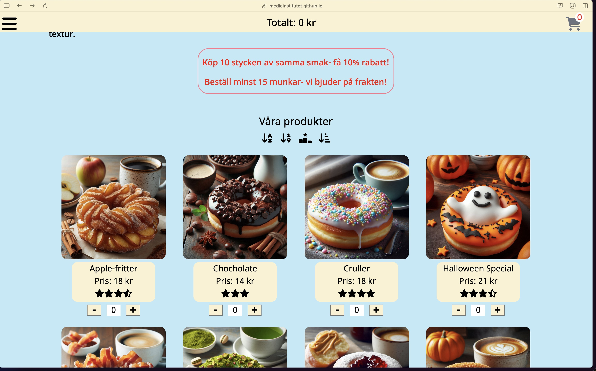

_Varukorgen med valda produkter och pris._
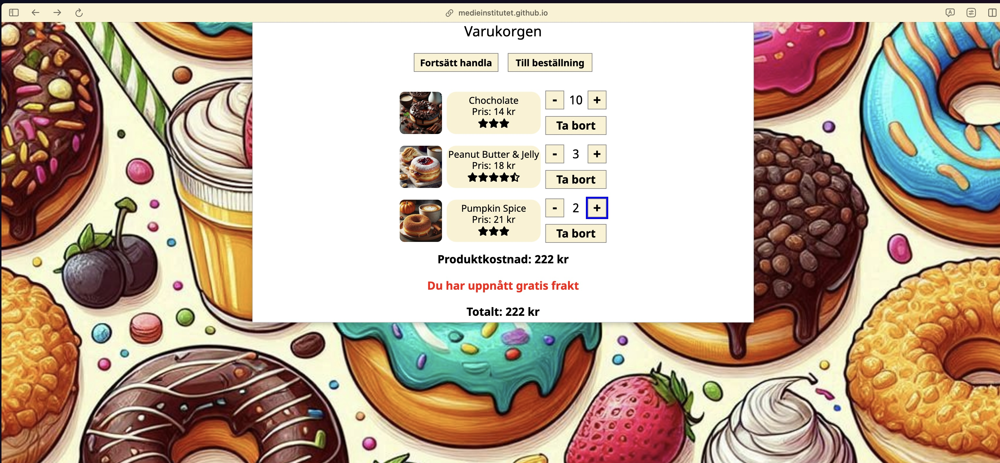

_Checkout med order sammanställning._
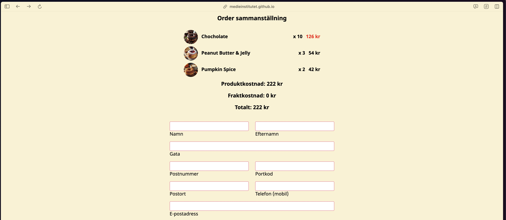

_Formulär med valt kortbetalning._
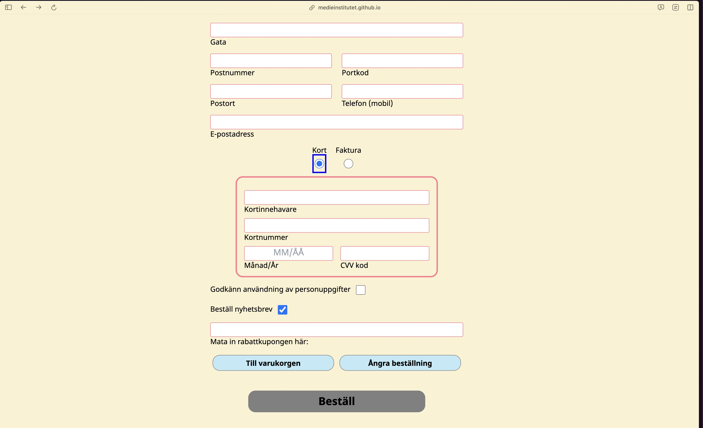

_Formulär med valt fakturabetalning._
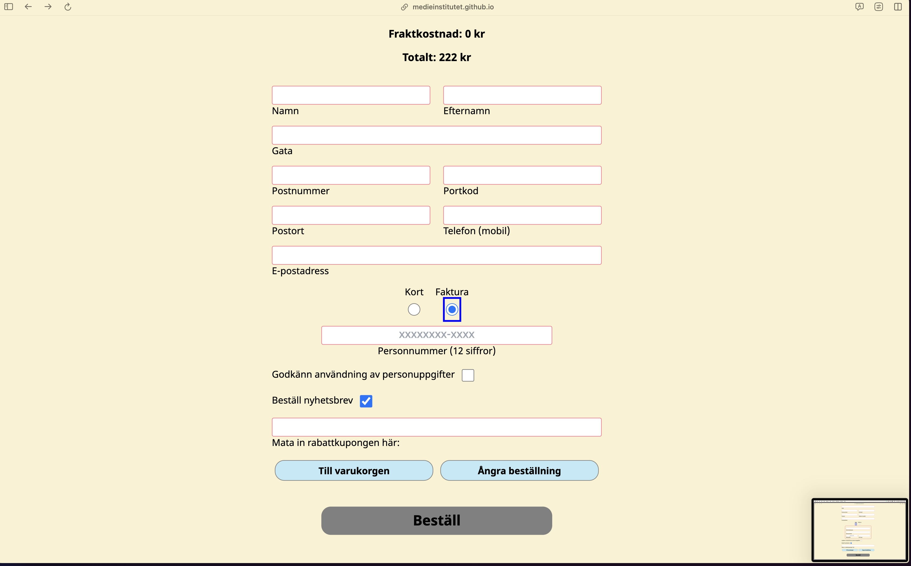

_Orderbekräftelse med användardata och leveransinformation._
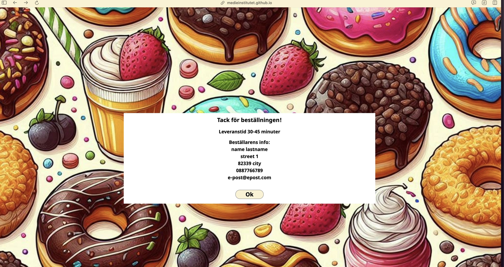

_Lightmode ikon._ 

_Darkmode ikon._ 

_Darkmode huvudsida._ 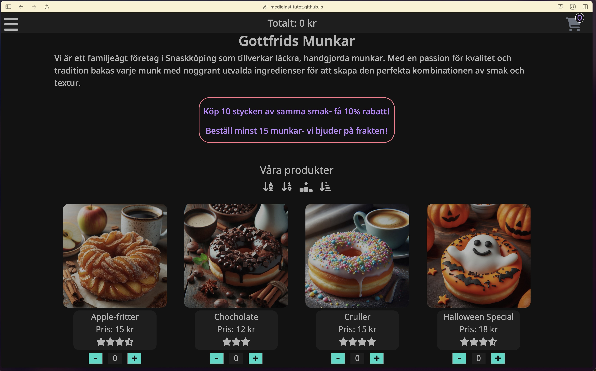

_Darkmode varukorg._ 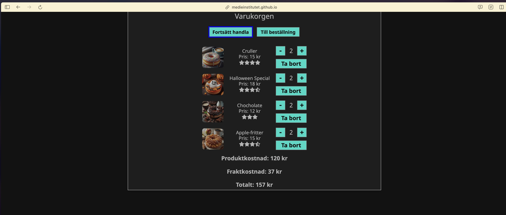

_Darkmode checkout._ 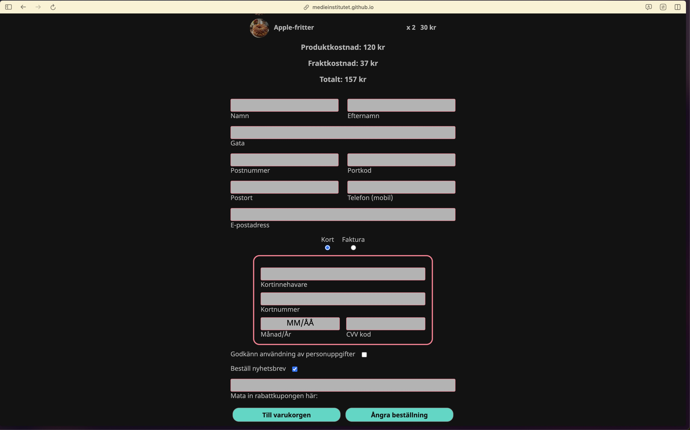

_Darkmode orderbekräftelse._
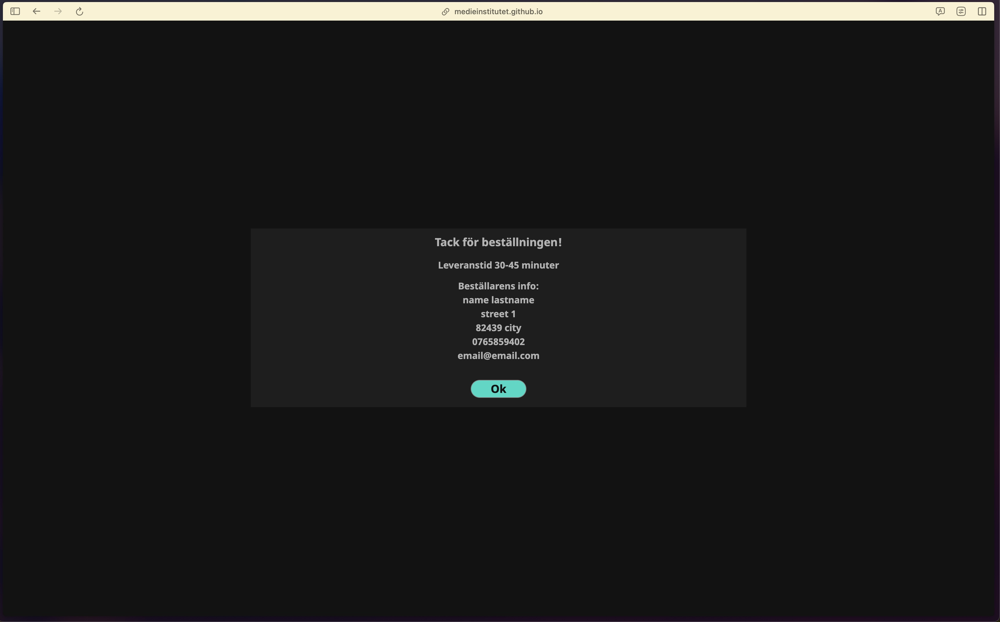

## Validering rapporter

_Index validering._ 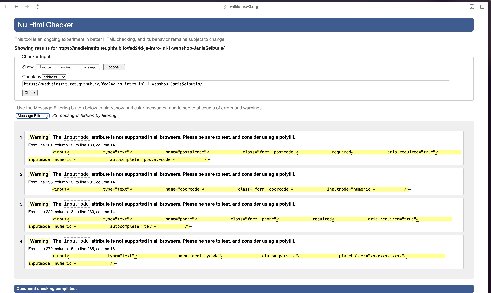

_Stylesheet validering._ 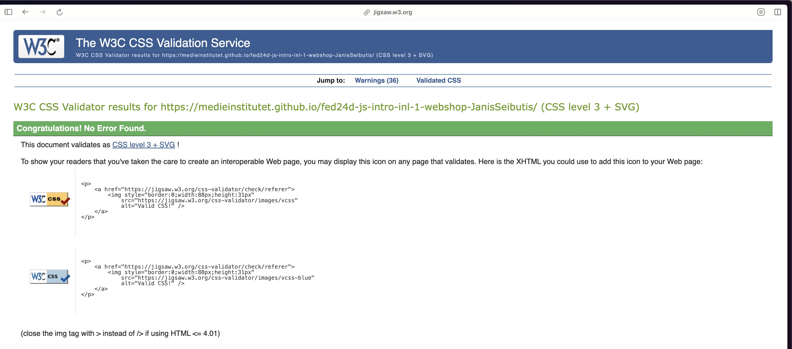

_Lighthouse analys._ 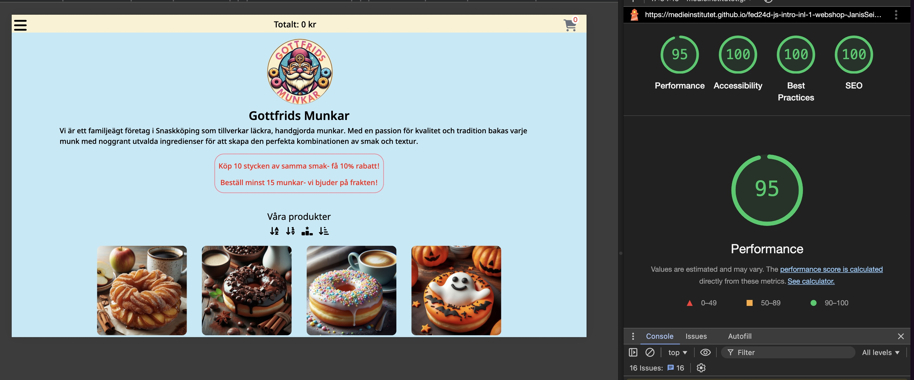
